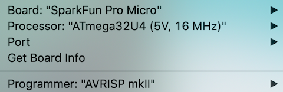

<h1>SDCARD Browser</h1>
I've created an SDCard browser for those of you in the possession of Norgate's excellent Pluggy Reloaded interface card.

Here's a video : https://www.youtube.com/watch?v=ozaQTK0C2vM
 
<h2>Building:</h2>
Copy the contents of the folder you downloaded into a BabelFish folder and use the BabelFish.ino to launch whatever Arduino IDE you use to program your Promicro, make sure to select the Release version, the Debug version will not fit!

Make sure your IDE settings look like this, (original image courtesy of Marcel).

 
<h2>General Info:</h2>
There is a maximum number of entries, (files and folders), per folder of 100, anymore than that will be ignored. The number of nested folders is only limited by the Arduino's RAM.

***"SDCARD_ERROR"*** will appear if no SDCard is present or if you change SDCards, click on it once you have inserted your new SDCard and the browser will happily start from the new SDCard's root directory.

***Note:1*** If you notice a slight flicker in your monitor as the SDCard browser queries BabelFish and the SDCard, that is completely normal. That is the browser sending data to BabelFish through Marcel's VSync/Hsync modulation Sys function.

***Note:2*** Comms between the browser and the SDCard can be variable, especially with long directories or slow SDCard's, be patient.

There are two possible ways of using this utility, pick one of them, (***NO_ROM*** or ***ROM***).
 
<h2>NO_ROM version:</h2>
You need to own a Pluggy Reloaded interface card. You also need to be able to program and upload to the Arduino micro on the Pluggy Reloaded interface card.

**BabelFish:**
- Should work with ALL versions from ROMv2 onward, it does NOT work with ROMv1.
- There is no room for any extra utilities.

**Launching:**
- There is no need to start the Loader first anymore, use the Left button + B button on the controller or CTRL+F2 on the keyboard to automatically launch the SDCard browser.

**Usage:**
- Down/Up buttons or Cursor keys move the highlight down/up the list.
- Left/Right buttons or Cursor keys page down/up the list.
- Button A or Enter key launches the file or enters the folder.
- Parent folder if one exists is accessible through the '..' entry.

**Files:**
- Click on the 'DOWNLOAD' button in the top right hand corner when viewing the BabelFish folder, this will download a zip file containing the folder's contents: https://www.dropbox.com/sh/d8v284j9j41b ... WuCUa?dl=0
 
<h2>ROM version:</h2>
- You need to own a Pluggy Reloaded interface card.
- You need to be able to program and upload to the Arduino micro on the Pluggy Reloaded interface card.
- You need to be able to re-program your Gigatron's EPROM/EEPROM, (if this does not compute, then head back to the NO_ROM version), also there is a thread here for more EPROM programming info: viewtopic.php?p=1528#p1528

**ROM:**
- This ROM, (SDCARD ROM), is a DEVROM based ROM with SDCard support and thus has full support for all of the ROMv5a feature set without the ROMv5a audio bug.
- The romType version number is 0xF0.

**BabelFish:**
- Should work with all ROM versions, but has been explicitly built for the SDCARD ROM's feature set and thus is fairly pointless to use with other ROM's.
- Had room left over for the Blinky, Terminal and WozMon .gt1 files.
- Bricks has been dropped in the latest version to make room.

**Launching:**
- No need to start Loader, head straight to the SDCard menu option, (if you want to access the built in .gt1 files, then start Loader and press CTRL+F1 for help).

**Usage:**
- Down/Up buttons or Cursor keys move the highlight down/up the list.
- Left/Right buttons or Cursor keys page down/up the list.
- Button A or Enter key launches the file or enters the folder.
- Parent folder if one exists is accessible through the '..' entry.

**Files:**
- Click on the 'DOWNLOAD' button in the top right hand corner when viewing the BabelFish folder, this will download a zip file containing the folder's contents: https://www.dropbox.com/scl/fo/k8i7ovot ... wmv0b&dl=0
